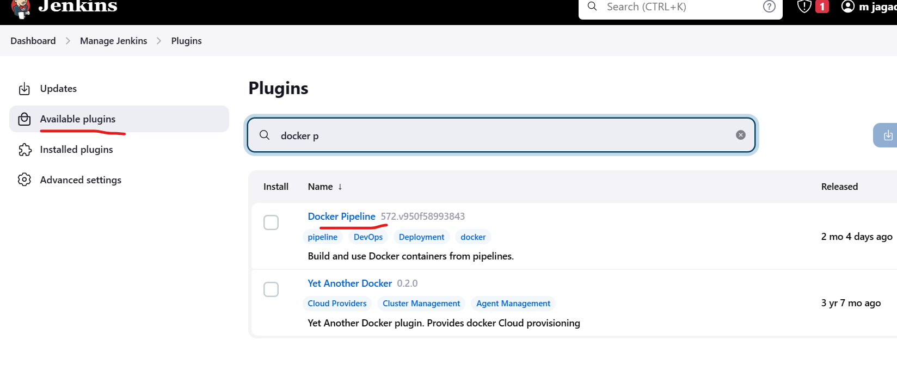

### To Run a Spring boot application

### Architecture of the project


### Install Jenkins

* to run jenkins we require java
* install jenkins and java [Refer Here](https://www.jenkins.io/doc/book/installing/linux/#debianubuntu) or run the belus script
```
#!/bin/bash
sudo apt update
sudo apt install openjdk-17-jdk -y
### jenkins installation
sudo wget -O /usr/share/keyrings/jenkins-keyring.asc \
  https://pkg.jenkins.io/debian-stable/jenkins.io-2023.key
echo deb [signed-by=/usr/share/keyrings/jenkins-keyring.asc] \
  https://pkg.jenkins.io/debian-stable binary/ | sudo tee \
  /etc/apt/sources.list.d/jenkins.list > /dev/null
sudo apt-get update
sudo apt-get install jenkins -y
```

* To get the Admin password


* Now install Docker plugin to run the jenkinsfile inside docker , Now docker will be an agent.




* now install sonar plugin


### create a new ec2 instance and configure a Sonar Server locally
```
sudo apt update
sudo apt install openjdk-11-jdk
sudo apt install unzip -y
sudo adduser sonarqube
sudo su - sonarqube
wget https://binaries.sonarsource.com/Distribution/sonarqube/sonarqube-9.6.1.59531.zip
unzip sonarqube-9.6.1.59531.zip
chmod -R 755 /home/sonarqube/sonarqube-9.6.1.59531
chown -R sonarqube:sonarqube /home/sonarqube/sonarqube-9.6.1.59531
cd sonarqube-9.6.1.59531/bin/linux-x86-64
./sonar.sh start
```

